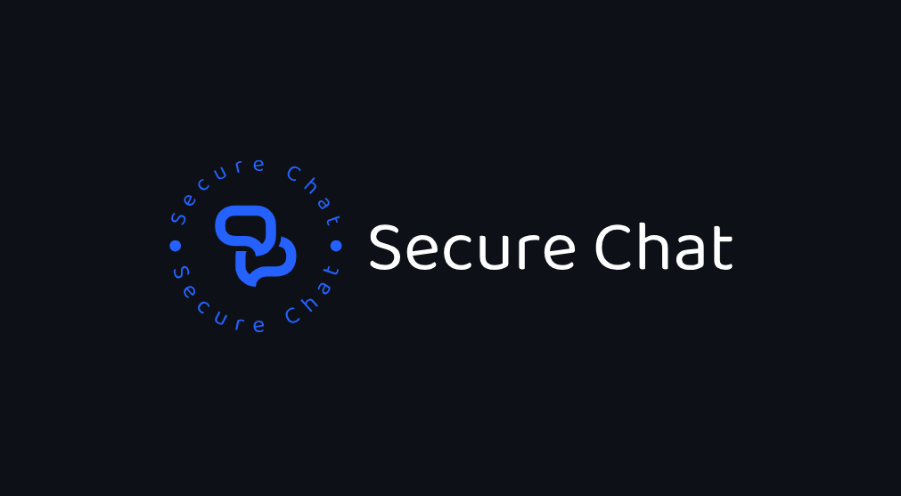
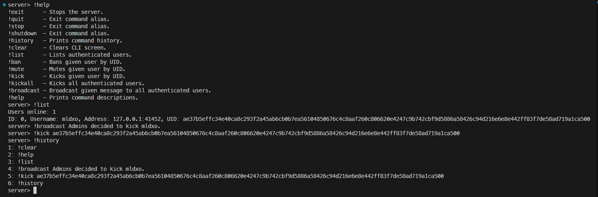

# Secure Chat

[](https://github.com/milosz275/secure-chat/actions/workflows/c-cpp.yml)
[](https://github.com/milosz275/secure-chat/actions/workflows/docker-image.yml)
[](https://github.com/milosz275/secure-chat/actions/workflows/codeql.yml)
[](https://github.com/milosz275/secure-chat/actions/workflows/doxygen-pages.yml)
[](https://github.com/milosz275/secure-chat/tags)
[](https://github.com/milosz275/secure-chat/releases)
[](https://github.com/milosz275/secure-chat/issues)
[](/LICENSE)



Secure Chat is a C program that allows you host decentralized system and chat securely with your friends. -It implements Diffie-Hellman (DH) key exchange to prevent man-in-the-middle (MitM) attacks, it uses the RSA algorithm to create sessions and AES algorithm for message end-to-end (EE2E) encryption-. Messages are stored in SQLite3 (ultimately other, distributed) database and can be read by the recipient only. Sending messages in optimized for maximum performance and resource usage.

- [GitHub repository](https://github.com/milosz275/secure-chat)
- [Docker repository](https://hub.docker.com/repository/docker/mlsh/secure-chat)
- [Doxygen documentation](https://milosz275.github.io/secure-chat/)

> [!IMPORTANT]
> This project is still in development and does not contain server distribution yet.

# Table of Contents

- [Security Measures](#security-measures)
- [Getting Started](#getting-started)
- [Components](#components)
- [Usage](#usage)
- [Server](#server)
- [Client](#client)
- [Common](#common)
- [Database](#database)
- [License](#license)
- [Authors](#authors)
- [Contributing](#contributing)

# Security Measures

The application uses the OpenSSL library for HTTPS connection, encryption, and decryption. The server acts as a buffer and router for clients. The following algorithms are used:

- **AES algorithm**: Used to encrypt and decrypt messages between clients.
- **Diffie-Hellman**: (DH) key exchange: Used to secretly exchange the AES encryption key between clients for each conversation.
- **RSA algorithm**: Used to create pre-shared public and private keys for each client, enabling secure message buffering when sending messages to new or offline users.

The server does not store any messages, only the public keys of the clients. The messages are stored in the SQLite3 database and can be read by the recipient only. The server does not have access to the messages.

## Schema of Security Workflow

### 1. Client Connection to the Server

1. **Client connects to the server via HTTPS**:
   - The connection between the client and the server is encrypted using **TLS** via HTTPS, ensuring secure data transmission.
   
2. **Client authentication**:
   - The client authenticates with the server (register/login).

3. **Public/Private Key Exchange**:
   - Upon initial registration, each client generates an **RSA public-private key pair**.
   - The **public key** is shared with the server, which stores it for later use.

### 2. Sending Messages Between Clients

#### Scenario 1: Sending a Message to an Online User

1. **Client A prepares a message for Client B**:
   - Client A composes the message.

2. **DH Key Exchange**:
   - If Client A and Client B have not previously communicated, a **Diffie-Hellman (DH) key exchange** takes place to establish a shared **AES key**.
   - This AES key is used to encrypt future messages between Client A and Client B.

3. **AES Encryption**:
   - The message is encrypted using the shared **AES key**.

4. **Message transmission**:
   - The encrypted message is sent to the server over the secure **HTTPS connection**.
   - The server forwards the encrypted message to Client B.

5. **Decryption**:
   - Client B uses the shared **AES key** to decrypt the message.

#### Scenario 2: Sending a Message to a New or Offline User

If Client A sends a message to Client B, and Client B is either **offline** or no prior DH key exchange has occurred (e.g., first-time contact):

1. **Client A retrieves Client B’s public RSA key**:
   - Client A requests **Client B’s public RSA key** from the server.

2. **AES Key Generation**:
   - Client A generates a **random AES key** to encrypt the message.

3. **Message Encryption**:
   - The message is encrypted using the newly generated **AES key**.
   - The **AES key** is then encrypted using **Client B's RSA public key**.

4. **Message and AES key transmission**:
   - Client A sends the **encrypted AES key** and the **encrypted message** to the server.
   - The server stores this encrypted data if Client B is offline.

5. **Client B retrieves the encrypted data**:
   - When Client B reconnects, they fetch the **encrypted message** and the **encrypted AES key** from the server.

6. **Decryption**:
   - Client B decrypts the **AES key** using their **RSA private key**.
   - Client B uses the decrypted AES key to **decrypt the message**.

### 3. Handling Different Devices and Stored Messages

#### Scenario 1: Using a New Device

1. **Unique DH Key Exchange**:
   - If Client B logs in from a new device, a new **Diffie-Hellman (DH) key exchange** occurs between Client A and Client B.
   - This establishes a new **AES key** for encryption between this specific device and Client A.

2. **Fetching stored messages**:
   - The server sends previously stored messages (encrypted with the old AES key) to Client B.

3. **Old Messages**:
   - Old messages cannot be decrypted using the new AES key, so Client A must re-encrypt future messages using the **newly derived AES key**.

4. **Multiple Devices**:
   - **Each device** has its own DH key exchange and generates its own AES key, ensuring that messages are independently encrypted and decrypted per device.

#### Scenario 2: Reusing the Same Device

1. **Reusing existing keys**:
   - If Client B logs in from the same device, the **AES key** from the previous DH exchange is reused.

2. **Fetching stored messages**:
   - If messages were sent while Client B was offline, the server delivers those **encrypted messages** to Client B.

3. **Decryption**:
   - Client B uses the **existing AES key** to decrypt the stored messages.

### 4. Key Management and Forward Secrecy

1. **Key derivation**:
   - The **shared secret** from the DH exchange is used with a **Key Derivation Function (KDF)** to generate a strong AES key.

2. **Key rotation**:
   - AES keys may be rotated periodically to ensure forward secrecy.

3. **Forward secrecy**:
   - The DH exchange ensures that past messages remain secure, even if long-term keys are compromised.

# Getting Started

These instructions will get you a copy of the project up and running on your local machine for development and testing purposes.

## Prerequisites

For a Debian-based system, you can install the following packages:

```bash
sudo apt install git gcc make sqlite3 libz-dev xorg-dev libc6-dev libxi-dev libssl-dev libuv1-dev libx11-dev libxrandr-dev libsqlite3-dev netcat-openbsd libasound2-dev libwayland-dev build-essential mesa-common-dev libgl1-mesa-dev libglu1-mesa-dev libcurl4-openssl-dev libxkbcommon-x11-dev libxkbcommon-dev
```

This should also work with Ubuntu and Linux Mint.

## Build

```bash
git clone https://github.com/milosz275/secure-chat
cd secure-chat
make
```

Run the server and client executables in separate terminals.

```bash
server/build/bin/server
```

```bash
client/build/bin/client
```

## Releases

You can download server and client from the [releases](https://github.com/milosz275/secure-chat/releases) page.

## Docker

You can also run the server using Docker.

```bash
docker pull mlsh/secure-chat
docker run -d -p 12345:12345 mlsh/secure-chat
```

# Components

## Server

Server is responsible for handling client connections, retrieving messages from the database and sending messages to the recipients. It also manages user registration and authentication according to the protocol. Multithreading is used to allow many concurrent requests and connections. Client connections are stored in a thread-safe hash map and only one logged instance of a client is allowed. Messages before handling are stored in thread-safe queue. Server facilitates CLI for system administration. Server logs all requests, client connections and errors.



## Client

Client connects to the server, sends messages and receives messages from the server. GUI is planned to be implemented with Raylib in next few PRs.

## Common

Common generates static library that is used by both server and client, i.e. communication protocol, encryption and decryption functions. It also defines the message structure, signal codes, data structures and functions that are shared between server and client.

## Database

SQLite3 database is utilized at the moment. There is planned usage of distributed database system [Cassandra](https://cassandra.apache.org/) or [MongoDB](https://www.mongodb.com/) in the further project iterations.

### Database Schema

Navigate to [database](https://github.com/milosz275/secure-chat/tree/main/database) for detailed database schema documentation.

# Current work

- [ ] Graphical user interface
- [ ] Direct message E2EE encryption
- [ ] Group chat support
- [x] Broadcast message support
- [ ] Database message save and synchronization
- [ ] Message history loading
- [ ] Server instances connection and synchronization
- [x] User activity tracking and polling (kick afk, statistics)
- [x] Server command line interface for system administration (!exit, !ban, !kick, !mute, !shutdown)
- [x] Protocol signal codes ("User is typing...", "User has read the message", "User has joined the chat")
- [x] Server logging (requests, client connections, errors)
- [ ] IP banning and rate limiting
- [ ] Server start arguments using argv[], argc and/or configuration file (port, database, log level)
- [ ] Interpreter for server automation

# License

This project is licensed under the MIT License - see the [LICENSE](https://github.com/milosz275/secure-chat/blob/main/LICENSE) file for details.

# Authors

- [milosz275](https://github.com/milosz275)
- [antk02](https://github.com/antk02)

# Contributing

Please refer to [CONTRIBUTING.md](https://github.com/milosz275/secure-chat/blob/main/CONTRIBUTING.md). We appreciate your help!

# Acknowledgments

- [Thread-safe queue](https://github.com/petercrona/StsQueue)
- [Thread-safe hash map](https://github.com/kshk123/hashMap)
