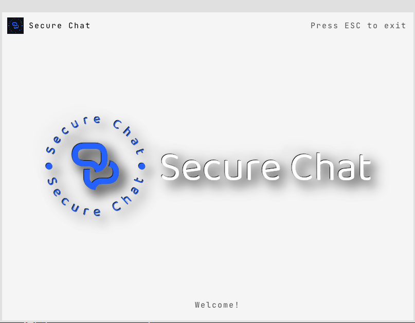

# Secure Chat

[](https://github.com/milosz275/secure-chat/actions/workflows/c-cpp.yml)
[](https://github.com/milosz275/secure-chat/actions/workflows/docker-image.yml)
[](https://github.com/milosz275/secure-chat/actions/workflows/codeql.yml)
[](https://github.com/milosz275/secure-chat/actions/workflows/doxygen-pages.yml)
[](https://github.com/milosz275/secure-chat/tags)
[](https://github.com/milosz275/secure-chat/releases)
[](https://github.com/milosz275/secure-chat/issues)
[](/LICENSE)


Secure Chat is my attempt at creating a C program allowing you host decentralized system and chat securely with your friends. It implements HTTPS connection (✔️) and AES algorithm is used for message end-to-end (EE2E) encryption (❌). Messages are stored in SQLite3 database and can be read by the recipient only. Sending messages in optimized for maximum performance and resource usage.

- [GitHub repository](https://github.com/milosz275/secure-chat)
- [Docker repository](https://hub.docker.com/repository/docker/mlsh/secure-chat)
- [Doxygen documentation](https://milosz275.github.io/secure-chat/)

> [!IMPORTANT]
> This project was not completed successfully and awaits second iteration.

## Table of Contents

- [Security Measures](#security-measures)
- [Getting Started](#getting-started)
  - [Prerequisites](#prerequisites)
  - [Build](#build)
  - [Releases](#releases)
  - [Docker](#docker)
- [Components](#components)
  - [Server](#server)
  - [Client](#client)
  - [Common](#common)
  - [Database](#database)
    - [Database Schema](#database-schema)
- [Current work](#current-work)
- [License](#license)
- [Authors](#authors)
- [Contributing](#contributing)
- [Acknowledgments](#acknowledgments)

## Security Measures

The application uses the OpenSSL library for HTTPS connection, encryption, and decryption. The server acts as a buffer and router for clients. The following algorithms are used:

- **AES algorithm**: Used to encrypt and decrypt messages between clients.

## Getting Started

These instructions will get you a copy of the project up and running on your local machine for development and testing purposes.

### Prerequisites

For a Debian-based system, you can install the following packages:

```bash
sudo apt install git gcc make sqlite3 libz-dev xorg-dev libc6-dev libxi-dev libssl-dev libuv1-dev libx11-dev libxrandr-dev libsqlite3-dev netcat-openbsd libasound2-dev libwayland-dev build-essential mesa-common-dev libgl1-mesa-dev libglu1-mesa-dev libcurl4-openssl-dev libxkbcommon-x11-dev libxkbcommon-dev
```

This should also work with Ubuntu and Linux Mint.

### Build

```bash
git clone https://github.com/milosz275/secure-chat
cd secure-chat
make
```

Run the server and client executables in separate terminals.

```bash
server/build/bin/server
```

```bash
client/build/bin/client
```

### Releases

You can download server and client from the [releases](https://github.com/milosz275/secure-chat/releases) page.

### Docker

You can also run the server using Docker.

```bash
docker pull mlsh/secure-chat
docker run -d -p 12345:12345 mlsh/secure-chat
```

## Components

### Server

Server is responsible for handling client connections, retrieving messages from the database and sending messages to the recipients. It also manages user registration and authentication according to the protocol. Multithreading is used to allow many concurrent requests and connections. Client connections are stored in a thread-safe hash map and only one logged instance of a client is allowed. Messages before handling are stored in thread-safe queue. Server facilitates CLI for system administration. Server logs all requests, client connections and errors.


### Client

Client connects to the server, sends messages and receives messages from the server. GUI is implemented using Raylib library and dark-mode is added. Dynamic signal resolution is used to allow for the best performance and resource usage. States are used to manage the client's connection and message sending. Client logs all requests, server connections and errors.



### Common

Common generates static library that is used by both server and client, i.e. communication protocol, encryption and decryption functions. It also defines the message structure, signal codes, data structures and functions that are shared between server and client.

### Database

SQLite3 database is utilized at the moment. There is planned usage of distributed database system [Cassandra](https://cassandra.apache.org/) or [MongoDB](https://www.mongodb.com/) in the further project iterations.

#### Database Schema

Navigate to [database](https://github.com/milosz275/secure-chat/tree/main/database) for detailed database schema documentation.

## Current work

- [x] Graphical user interface
- [ ] Direct message E2EE encryption
- [ ] Group chat support
- [x] Broadcast message support
- [ ] Database message save and synchronization
- [ ] Message history loading
- [ ] Server instances connection and synchronization
- [x] User activity tracking and polling (kick afk, statistics)
- [x] Server command line interface for system administration (!exit, !ban, !kick, !mute, !shutdown)
- [x] Protocol signal codes ("User is typing...", "User has read the message", "User has joined the chat")
- [x] Server logging (requests, client connections, errors)
- [ ] IP banning and rate limiting
- [ ] Server start arguments using argv[], argc and/or configuration file (port, database, log level)
- [ ] Interpreter for server automation

## License

This project is licensed under the MIT License - see the [LICENSE](https://github.com/milosz275/secure-chat/blob/main/LICENSE) file for details.

## Authors

- [milosz275](https://github.com/milosz275)
- [antk02](https://github.com/antk02)

## Contributing

Please refer to [CONTRIBUTING.md](https://github.com/milosz275/secure-chat/blob/main/CONTRIBUTING.md). We appreciate your help!

## Acknowledgments

- [Thread-safe queue](https://github.com/petercrona/StsQueue)
- [Thread-safe hash map](https://github.com/kshk123/hashMap)
