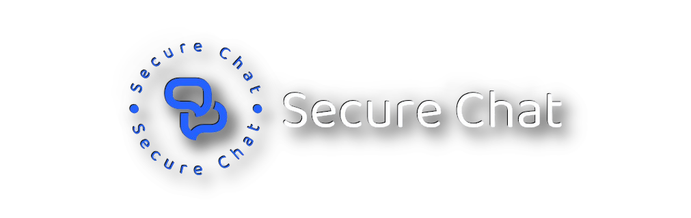

# Secure Chat

[](https://github.com/mldxo/secure-chat/actions/workflows/docker-image.yml)
[](https://github.com/mldxo/secure-chat/actions/workflows/codeql.yml)
[](https://github.com/mldxo/secure-chat/actions/workflows/doxygen-pages.yml)
[](https://github.com/mldxo/secure-chat/tags)
[](https://github.com/mldxo/secure-chat/releases)
[](https://github.com/mldxo/secure-chat/issues)
[](/LICENSE)



Secure Chat is a C program that allows you to chat securely with your friends. It uses the RSA algorithm to encrypt and decrypt messages and the Diffie-Hellman algorithm to exchange keys. Messages are stored in Cassandra database and can be read by the recipient only. Sending messages in optimized for maximum performance and resource usage.

- [GitHub repository](https://github.com/mldxo/secure-chat)
- [Docker repository](https://hub.docker.com/repository/docker/mlsh/secure-chat)
- [Doxygen documentation](https://mldxo.github.io/secure-chat/)

> [!IMPORTANT]
> This project is still in development and is not ready for production use.

# Table of Contents

- [Getting Started](#getting-started)
- [Components](#components)
- [Usage](#usage)
- [Server](#server)
- [Client](#client)
- [Common](#common)
- [Database](#database)
- [License](#license)
- [Authors](#authors)
- [Contributing](#contributing)

# Getting Started

These instructions will get you a copy of the project up and running on your local machine for development and testing purposes.

```bash
git clone https://github.com/mldxo/secure-chat
cd secure-chat
git submodule update --init --recursive
make
```

Run the server and client executables in separate terminals.

```bash
server/build/bin/server
```

```bash
client/build/bin/client
```

## Docker

You can also run the server instances in Docker container.

```bash
docker build . -t secure-chat:latest
docker-compose up
```

# Components

## Server

Server is responsible for handling client connections, retrieving messages from the database and sending messages to the recipients.

## Client

Client connects to the server, sends messages and receives messages from the server.

## Common

Common generates static library that is used by both server and client, i.e. communication protocol, encryption and decryption functions.

## Database

SQLite3 database is utilized at the moment. There is planned usage of distributed database system [Cassandra](https://cassandra.apache.org/) or [MongoDB](https://www.mongodb.com/) in the further project iterations.

### Database Schema

Navigate to [server](/server) for detailed database schema documentation.

# License

This project is licensed under the MIT License - see the [LICENSE](https://github.com/mldxo/secure-chat/blob/main/LICENSE) file for details.

# Authors

- [mldxo](https://github.com/mldxo)
- [antk02](https://github.com/antk02)

# Contributing

Please refer to [CONTRIBUTING.md](https://github.com/mldxo/secure-chat/blob/main/CONTRIBUTING.md). We appreciate your help!
